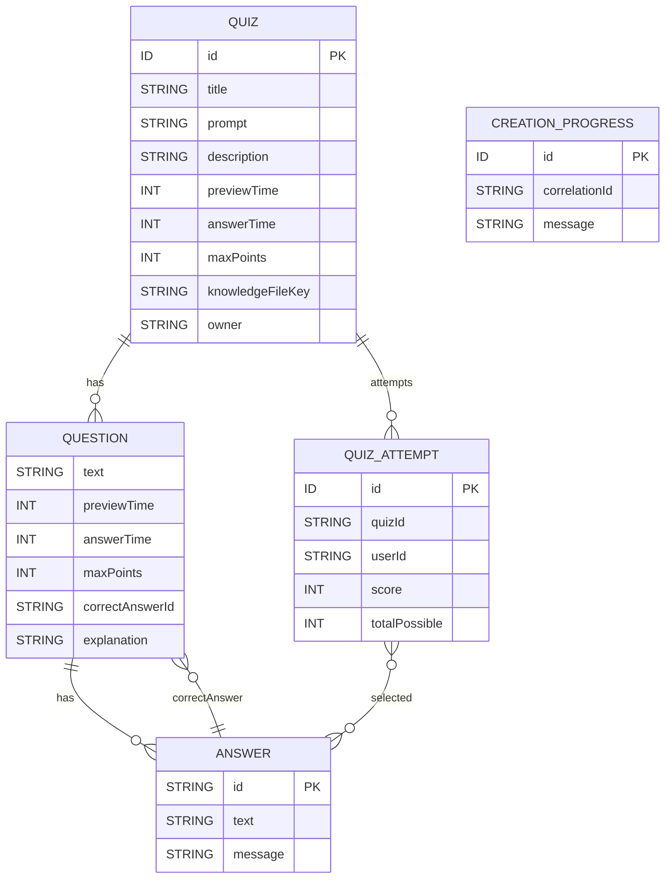

```mermaid
    erDiagram
        QUIZ {
            ID id PK
            STRING title
            STRING prompt
            STRING description
            INT previewTime
            INT answerTime
            INT maxPoints
            STRING knowledgeFileKey
            STRING owner
        }

        QUESTION {
            STRING text
            INT previewTime
            INT answerTime
            INT maxPoints
            STRING correctAnswerId
            STRING explanation
        }

        ANSWER {
            STRING id PK
            STRING text
            STRING message
        }

        QUIZ_ATTEMPT {
            ID id PK
            STRING quizId
            STRING userId
            INT score
            INT totalPossible
        }

        CREATION_PROGRESS {
            ID id PK
            STRING correlationId
            STRING message
        }

        %% Relationships
            QUIZ ||--o{ QUESTION : "has"
            QUESTION ||--o{ ANSWER : "has"
            QUESTION }o--|| ANSWER : "correctAnswer"
            QUIZ ||--o{ QUIZ_ATTEMPT : "attempts"
            QUIZ_ATTEMPT }o--o{ ANSWER : "selected"
```
